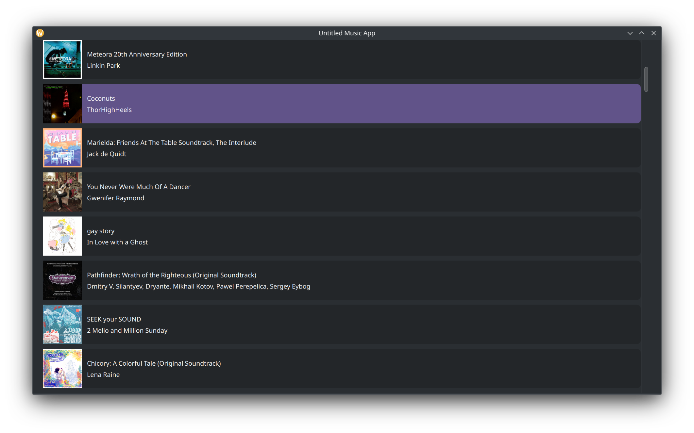

# Untitled Music App

...working title

Just playing around with Pyside6, nothing to see here!

## Installation

Create a virtual env that allows access to system packages, run `pip install -e .`.

## Building

Install any build deps by running `pip install -e .[install]` and then run `pyinstaller --add-data ./src/untitledmusicplayer/qml:untitledmusicplayer/qml ./src/untitledmusicplayer/app.py` to build the app.

It will then appear in `dist/app/app` (or `dist/app/app.exe` on windows.)